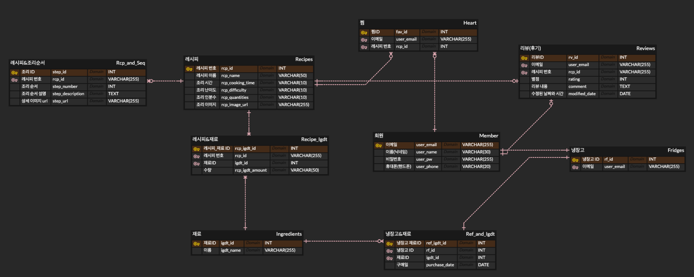
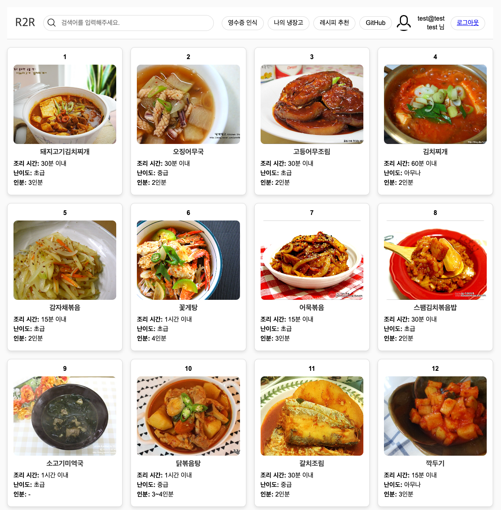
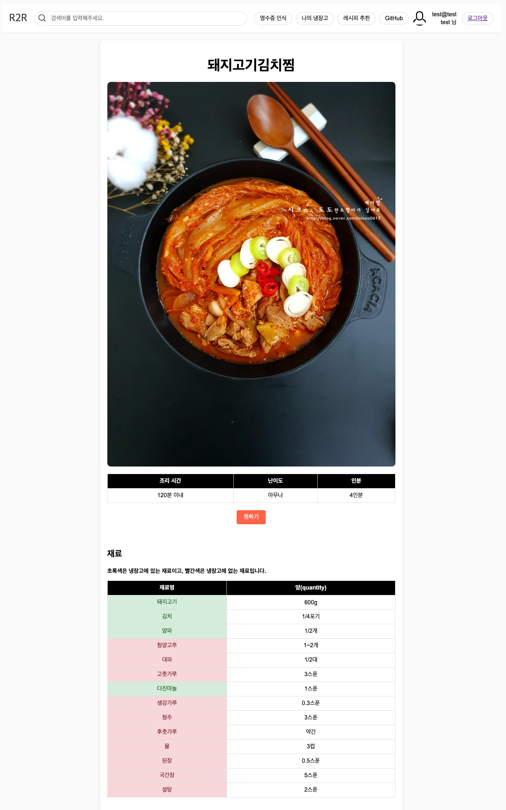
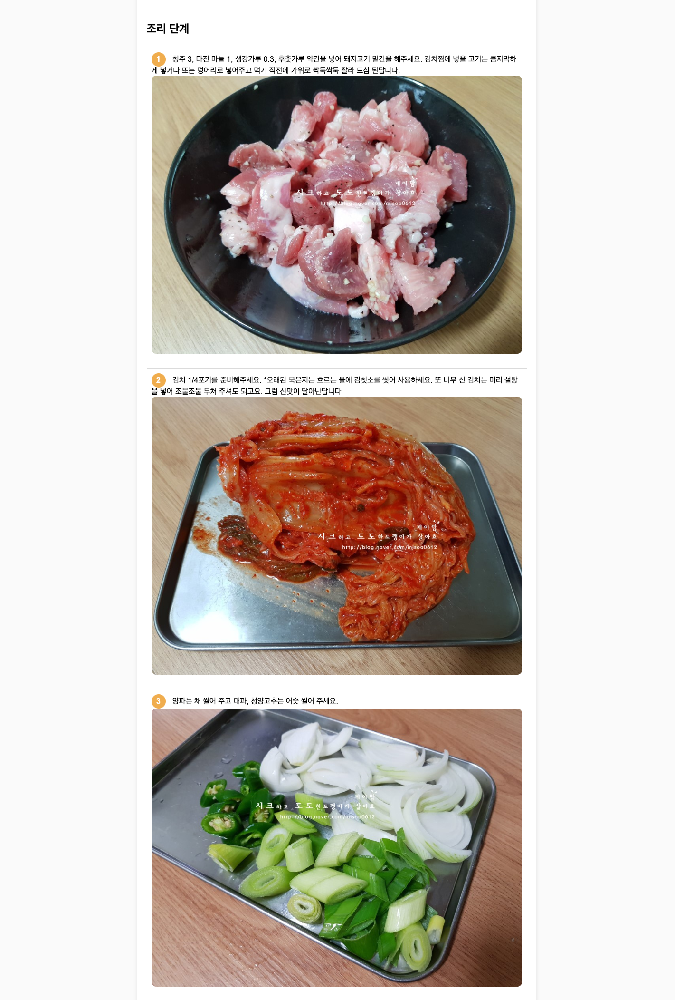
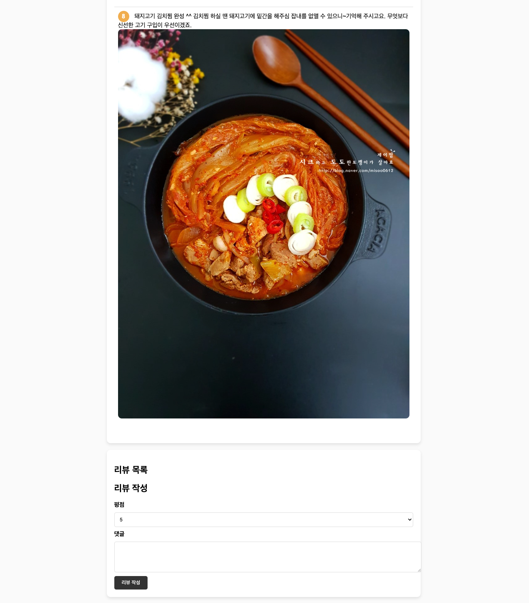
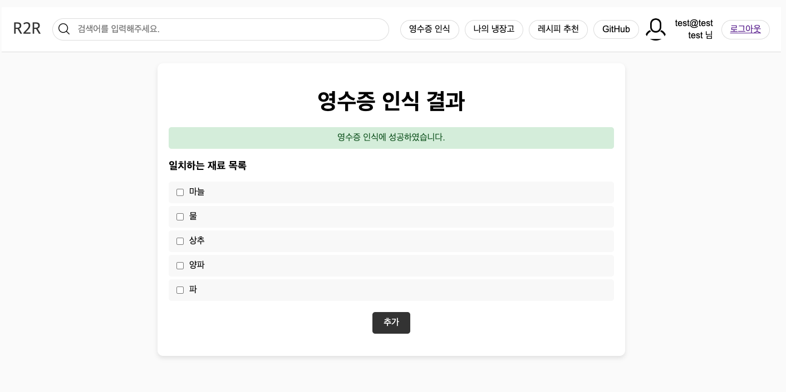
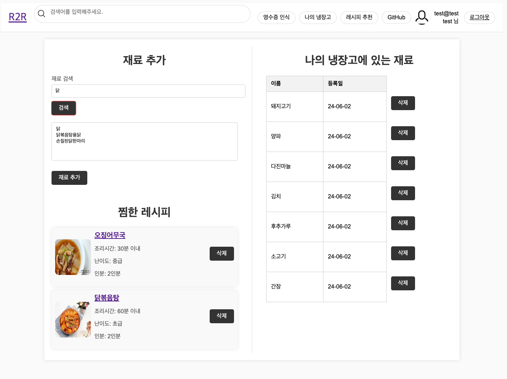
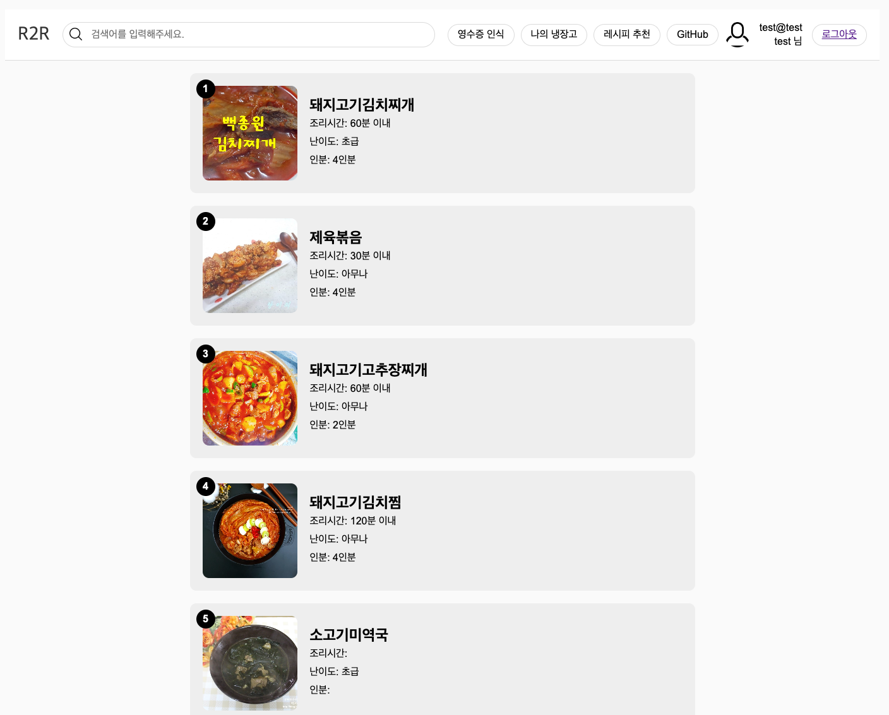

# 강원대학교 캡스톤디자인 - Recepit2Recipe

---

## Product

**영수증 인식 또는 사용자가 추가한 식재료를 바탕으로 레시피 추천 플랫폼**


---


## Members & Role

### Members

| 이름   | 학과         | 역할                    |
| ------ | ------------ | ----------------------- |
| 이승욱 | AI소프트웨어 | Back-End, Web Front-End |
| 채정민 | AI소프트웨어 | 데이터베이스 모델링     |
| 송기남 | AI소프트웨어 | UI                      |
| 이창엽 | AI소프트웨어 | Mobile Front-End        |

<br>

### Role

| 역할                | 설명                                                         |
| ------------------- | ------------------------------------------------------------ |
| Back-End            | -애플리케이션의 핵심 기능과 비즈니스 로직을 구현하는 역할<br />-데이터베이스와 클라이언트(프론트엔드) 간의 통신을 관리하고, 사용자 요청을 처리하여 적절한 응답을 제공<br />-RESTful API를 설계하고 개발하여 클라이언트가 서버와 상호작용할 수 있도록 함 |
| 데이터베이스 모델링 | -데이터베이스 모델링을 통하여 데이터 구조를 명확히 정의하여 데이터 일관성을 유지하고 무결성을 보장<br />-이를 통해 데이터 중복을 줄이고 데이터의 정확성과 신뢰성을 확보 |
| UI                  | -사용자에게 직관적이고 아름다운 인터페이스를 제공하여 사용 편의성 높이고, 좋은 경험을 할 수 있게 함 |
| Front-End           | -사용자와 직접 상호작용하는 웹과 모바일 애플리케이션의 UI와 UX를 구현하여 사용자 경험을 향상시킴<br />-이를 통해 직관적이고 반응성 높은 인터페이스를 제공하여 사용자 만족도와 접근성을 높임 |

<br>

---

<br>

## Architecture


레시피 데이터는 만개의 레시피에서 얻었음을 알립니다. https://www.10000recipe.com/

<br>

---

<br>

## Database Modelling 

<a href="images/README/ERD.png" target="_blank"></a>

- `Member`와 `Fridge`: 1대1(One-to-One) 관계로, 한 회원은 하나의 냉장고만 가질 수 있다.
- `Fridge`와 `Ref_and_Igdt`: 1대다(One-to-Many) 관계로, 한 냉장고는 여러 재료를 가질 수 있다.
- `Ingredients`와 `Ref_and_Igdt`: 1대다(One-to-Many) 관계로, 한 재료는 여러 냉장고 재료에 포함될 수 있다.
- `Recipes`와 `Rcp_and_Seq`: 1대다(One-to-Many) 관계로, 한 레시피는 여러 조리 단계를 가질 수 있다.<br>
  ->`Rcp_and_Seq` 테이블의 `rcp_id` 필드는 `Recipes` 테이블의 `rcp_id`를 참조하여 각 조리 단계가 어떤 레시피에 속하는지를 정의.
- `Recipes`와 `Recipe_Igdt`: 1대다(One-to-Many) 관계로, 한 레시피는 여러 재료를 가질 수 있다.
- `Ingredients`와 `Recipe_Igdt`: 1대다(One-to-Many) 관계로, 한 재료는 여러 레시피 재료에 포함될 수 있다.
- `Member`와 `Heart`: 1대다(One-to-Many) 관계로, 한 회원은 각 레시피에 대해 하나의 찜만 할 수 있다 (UNIQUE 제약 조건).
- `Recipes`와 `Heart`: 1대다(One-to-Many) 관계로, 한 레시피는 여러 회원에게 찜받을 수 있다.
- `Member`와 `Reviews`: 1대다(One-to-Many) 관계로, 한 회원은 각 레시피에 대해 하나의 리뷰만 남길 수 있다 (UNIQUE 제약 조건).
- `Recipes`와 `Reviews`: 1대다(One-to-Many) 관계로, 한 레시피는 여러 리뷰를 받을 수 있다.

- **다대다 관계는 `Recipe_Igdt`와 `Ref_and_Igdt` 테이블을 통해 구현됨.**

> [!TIP]
>
> <u>**다대다(Many-to-Many) 관계는 두 테이블 간의 다수의 레코드가 서로 다수의 레코드와 관련될 수 있는 관계를 말한다.**</u> 
>
> 예를 들어, 하나의 레시피는 여러 재료를 필요로 하고, 하나의 재료는 여러 레시피에 포함될 수 있다. 이런 관계를 직접 테이블 간에 구현하면 복잡하고, 데이터의 일관성을 유지하기 어렵다. 
>
> 그래서 다대다 관계를 구현하기 위해 중간 테이블을 사용한다. 
>
> 중간 테이블은 두 테이블 간의 관계를 관리한다.

<br>

---

<br>

## Tech-Stack

| 분류              | 기술                        |
| ----------------- | --------------------------- |
| 서버 환경         | AWS Ubuntu LTS, Amazon RDS  |
| DB                | MySQL                       |
| Back-End          | Spring Boot, JPA(Hibernate) |
| Front-End(Web)    | HTML, CSS, JavaScript       |
| Front-End(Mobile) | Android Native(Kotlin)      |
| API               | Google Cloud Vision API     |
| Mobile UI         | Figma                       |

<br>

---

<br>

## Design

### Web















<br>

### Mobile


<모바일 UI는 아직 준비 중입니다.>


<br>

---

<br>

### 레시피 추천 원리

> [!IMPORTANT]
>
> 1. 하나의 레시피의 재료 중에서 **핵심이 되는 재료를 보유하고 있지 않다면 추천 리스트에서 제외**한다. <br>
>    예를 들어, 김치찌개 레시피 재료 중에서 김치가 없다면, 김치찌개 레시피는 추천하지 않는다.
> 2. **하나의 레시피의 총 재료수를 사용자가 보유한 해당 레시피 재료의 수로 나눈 값을 정렬하여, 상위 10개의 레시피를 추천**한다.<br>
>    예를 들어, 10개의 재료를 요구하는 레시피에서 사용자가 10개를 보유하고 있다면 10 / 10 = 1<br>
>    5개의 재료를 보유하고 있다면, 10 / 5 = 2<br>
>    이후 값이 작은 순으로 정렬하여 상위 10개의 레시피를 추천

<br>

---

<br>

## API

> [!TIP]
>
> BASE URL : https://r2-r.com/ <br>
>
> 24년 6월 9일 이후로 비용 문제로 AWS 서버를 닫습니다.

<br>

------

<br>

### Login

#### 요청

요청 경로 : `/api/login/sign_in`

메서드 : `POST`

```json
{
    "userEmail": "asd@asd",
    "userPw": "asd"
}
```

<br>

#### 응답

성공

```json
{
    "message": "Login successful"
}
```

실패

-비밀번호 오류

```json
{
    "message": "Invalid credentials"
}
```

-존재하지 않는 이메일

```json
{
    "message": "User not found"
}
```

<br>

---

<br>

### 회원가입

#### 요청

요청 경로 : `/api/login/sign_up`

메서드 : `POST`

```json
{
    "userEmail": "test@test",
    "userName": "name",
    "userPw": "1234",
    "userPhone": "123-456-7890"
}
```

<br>

#### 응답

성공

```json
{
	"message": "Sign up successful"
}
```

실패

```json
{
	"message": "Sign up failed"
}
```

<br>

---

<br>

### Logout

#### 요청

요청 경로 : `/api/login/sign_out`

메서드 : `POST`

```
 요청 본문은 필요하지 않다.
 로그인된 세션의 쿠키가 자동으로 포함
```

<br>

#### 응답

성공

```json
{
  "message": "Logout successful"
}
```

실패

```
존재하지 않음
```

<br>

---

<br>

### 세션 확인

#### 요청

요청 경로 : `/api/login/check_session`

메서드 : `GET`

<br>

#### 응답

성공

```json
{
  "message": "Session is valid", 
  "userEmail": "test@test"
}
```

실패

```json
{
  "message": "Session is invalid"
}
```

<br>

---

<br>

### 세션이 만료되었거나, 없을 때 응답(권한 부족)

```json
{
	"message": "Unauthorized"
}
```

<br>

---

<br>

### 모든 레시피 리스트

#### 요청

요청경로 : `/api/all_rcplist`

메서드 : `GET`

<br>

### 응답 예시

```json
[
    {
        "rcpId": 1785098,
        "rcpName": "돼지고기김치찌개",
        "rcpCookingTime": "30분 이내",
        "rcpDifficulty": "초급",
        "rcpImageUrl": "<https://recipe1.ezmember.co.kr/cache/recipe/2015/08/25/a01d013a6b6f9d526c43f4659db2cd61.jpg>",
        "rcpQuantities": "3인분"
    },
    {
        "rcpId": 1787453,
        "rcpName": "오징어무국",
        "rcpCookingTime": "30분 이내",
        "rcpDifficulty": "중급",
        "rcpImageUrl": "<https://recipe1.ezmember.co.kr/cache/recipe/2015/07/24/2c659daaae3ccd3de0e917aa8e04403a.jpg>",
        "rcpQuantities": "2인분"
    },
    {
        "rcpId": 3568149,
        "rcpName": "고등어무조림",
        "rcpCookingTime": "30분 이내",
        "rcpDifficulty": "초급",
        "rcpImageUrl": "<https://recipe1.ezmember.co.kr/cache/recipe/2015/05/27/d776a52f6fda01bb6ed1d4bdfb7821ce1.jpg>",
        "rcpQuantities": "2인분"
    },
    ....
}
```

<br>

---

<br>

### 5개 레시피 리스트

#### 요청

요청경로 : `/api/5_rcplist`

메서드 : `GET`

<br>

#### 응답 예시

```json
[
    {
        "rcpId": 1785098,
        "rcpName": "돼지고기김치찌개",
        "rcpCookingTime": "30분 이내",
        "rcpDifficulty": "초급",
        "rcpImageUrl": "<https://recipe1.ezmember.co.kr/cache/recipe/2015/08/25/a01d013a6b6f9d526c43f4659db2cd61.jpg>",
        "rcpQuantities": "3인분"
    },
    {
        "rcpId": 1787453,
        "rcpName": "오징어무국",
        "rcpCookingTime": "30분 이내",
        "rcpDifficulty": "중급",
        "rcpImageUrl": "<https://recipe1.ezmember.co.kr/cache/recipe/2015/07/24/2c659daaae3ccd3de0e917aa8e04403a.jpg>",
        "rcpQuantities": "2인분"
    },
    {
        "rcpId": 3568149,
        "rcpName": "고등어무조림",
        "rcpCookingTime": "30분 이내",
        "rcpDifficulty": "초급",
        "rcpImageUrl": "<https://recipe1.ezmember.co.kr/cache/recipe/2015/05/27/d776a52f6fda01bb6ed1d4bdfb7821ce1.jpg>",
        "rcpQuantities": "2인분"
    },
    {
        "rcpId": 3686217,
        "rcpName": "김치찌개",
        "rcpCookingTime": "60분 이내",
        "rcpDifficulty": "아무나",
        "rcpImageUrl": "<https://recipe1.ezmember.co.kr/cache/recipe/2015/08/25/d1754942db6cebf74146eff6225e620d1.jpg>",
        "rcpQuantities": "2인분"
    },
    {
        "rcpId": 4007561,
        "rcpName": "감자채볶음",
        "rcpCookingTime": "15분 이내",
        "rcpDifficulty": "초급",
        "rcpImageUrl": "<https://recipe1.ezmember.co.kr/cache/recipe/2015/09/03/7b212e9f49ebe4a5fd27507ce388e7d81.jpg>",
        "rcpQuantities": "2인분"
    }
]
```

<br>

---

<br>

### 나의 냉장고에 저장된 재료

#### 요청

요청 경로 : `/api/my_igdts`

메서드 : `GET`

<br>

#### 응답 예시

```json
[
    {
        "igdtId": 22,
        "name": "마늘",
        "purchaseDate": "2024-05-29T22:28:06.277+00:00"
    },
    {
        "igdtId": 7,
        "name": "물",
        "purchaseDate": "2024-05-29T22:28:06.284+00:00"
    },
    {
        "igdtId": 208,
        "name": "상추",
        "purchaseDate": "2024-05-29T22:28:06.286+00:00"
    },
    {
        "igdtId": 6,
        "name": "양파",
        "purchaseDate": "2024-05-29T22:28:06.289+00:00"
    },
    {
        "igdtId": 31,
        "name": "파",
        "purchaseDate": "2024-05-29T22:28:06.292+00:00"
    }
]
```

<br>

---

<br>

### 나의 찜 목록

#### 요청

요청 경로 : `/api/my_hearts`

메서드 : `GET`

<br>

#### 응답 예시

```json
[
    {
        "rcpId": 3568149,
        "rcpName": "고등어무조림",
        "rcpCookingTime": "30분 이내",
        "rcpDifficulty": "초급",
        "rcpImageUrl": "<https://recipe1.ezmember.co.kr/cache/recipe/2015/05/27/d776a52f6fda01bb6ed1d4bdfb7821ce1.jpg>",
        "rcpQuantity": "2인분"
    },
    {
        "rcpId": 6889570,
        "rcpName": "돼지고기김치찜",
        "rcpCookingTime": "120분 이내",
        "rcpDifficulty": "아무나",
        "rcpImageUrl": "<https://recipe1.ezmember.co.kr/cache/recipe/2018/05/25/53402adf0a5eb2b854649925343219481.jpg>",
        "rcpQuantity": "4인분"
    }
]
```

<br>

---

<br>

### 레시피 상세정보

#### 요청

요청 경로 : `/api/detail/레시피번호`

메서드 : `GET`

<br>

#### 응답 예시

```json
{
    "rcpName": "오징어무국",
    "rcpCookingTime": "30분 이내",
    "rcpDifficulty": "중급",
    "rcpImageUrl": "<https://recipe1.ezmember.co.kr/cache/recipe/2015/07/24/2c659daaae3ccd3de0e917aa8e04403a.jpg>",
    "rcpQuantities": "2인분",
    "rcpSteps": [
        {
            "stepNumber": 1,
            "description": "오징어 1마리는 안쪽에 칼집을내고, 무우도 적당한 크기로 잘라 두줌정도 준비합니다.",
            "stepUrl": "<https://recipe1.ezmember.co.kr/cache/recipe/2015/07/29/bbb4005059b226b9c9222691d2be180f1.jpg>"
        },
        {
            "stepNumber": 2,
            "description": " 멸치, 다시마, 디포리 육수를 내서 물이 끓으면 무를 먼저 넣고 한소끔 끓이고",
            "stepUrl": "<https://recipe1.ezmember.co.kr/cache/recipe/2015/07/29/12acffa2a5c0d64e38dc3ef082b7f4961.jpg>"
        },
        {
            "stepNumber": 3,
            "description": "다진마늘을 1/3큰술 정도 넣어요.",
            "stepUrl": "<https://recipe1.ezmember.co.kr/cache/recipe/2015/07/29/38fdcd6bfdf712b94f0274d1e34cd5211.jpg>"
        },
        {
            "stepNumber": 4,
            "description": " 무가 어느정도 익었으면 오징어와 고추가루를 넣어줍니다. 처음에 무랑 같이 오징어를 넣으면 질겨질 수가 있으니 오징어는 나중에 넣고 팔팔 끓여요..",
            "stepUrl": "<https://recipe1.ezmember.co.kr/cache/recipe/2015/07/29/e3fbcd1594471fffd995d93b38e211f91.jpg>"
        },
        {
            "stepNumber": 5,
            "description": " 간은 신안 함초 천일염으로 합니다. 마트에서 판매하는 가공소금으로 간을 맞춘것과는 국물맛이 확실히 달라요~ 개운하고 감칠맛이 납니다요~",
            "stepUrl": "<https://recipe1.ezmember.co.kr/cache/recipe/2015/07/29/13a8088f0b5bf95aa378a30ddb81fbef1.jpg>"
        },
        {
            "stepNumber": 6,
            "description": " 대파를 넣고 마지막에 사진에서 보이듯이 윗부분에 뜨는 불순물을 숟가락을 떠 내세요. 그래야 깔끔한 국물이 됩니다.",
            "stepUrl": "<https://recipe1.ezmember.co.kr/cache/recipe/2015/07/29/4cec7c14eacad2bfa18cdbb534e083851.jpg>"
        },
        {
            "stepNumber": 7,
            "description": " 밥 말아 먹으면 아주 개운하고 시원한 오징어 국 완성이요~!!",
            "stepUrl": "<https://recipe1.ezmember.co.kr/cache/recipe/2015/07/29/67f3937c13941dec5b380517b77cf1fc1.jpg>"
        }
    ],
    "rcpIgdt": [
        {
            "isExist": false,
            "igdtName": "오징어"
        },
        {
            "isExist": false,
            "igdtName": "무"
        },
        {
            "isExist": false,
            "igdtName": "멸치"
        },
        {
            "isExist": false,
            "igdtName": "다시마"
        },
        {
            "isExist": false,
            "igdtName": "디포리"
        },
        {
            "isExist": false,
            "igdtName": "다진마늘"
        },
        {
            "isExist": false,
            "igdtName": "소금"
        },
        {
            "isExist": false,
            "igdtName": "대파"
        }
    ],
    "rcpReview": [
        {
            "userEmail": "asd@asd",
            "rating": 5,
            "comment": "asfsdf",
            "modifiedDate": "2024-05-27T08:12:59.0221"
        }
    ]
}
```

<br>

---

<br>

### 레시피 추천

#### 요청

요청 경로 : `/api/recommend_recipes`

메서드 : `GET`

<br>

#### 응답 예시

```json
[
    {
        "rcpId": 6885185,
        "rcpName": "돼지고기고추장찌개",
        "rcpCookingTime": "60분 이내",
        "rcpDifficulty": "아무나",
        "rcpImageUrl": "<https://recipe1.ezmember.co.kr/cache/recipe/2018/02/23/6301ea463593d23b0adc8694178ad0aa1.jpg>",
        "rcpQuantities": "2인분"
    },
    {
        "rcpId": 6841008,
        "rcpName": "제육볶음",
        "rcpCookingTime": "30분 이내",
        "rcpDifficulty": "아무나",
        "rcpImageUrl": "<https://recipe1.ezmember.co.kr/cache/recipe/2016/01/03/2719de5f7ea19aceb5b859d36b853b481.jpg>",
        "rcpQuantities": "4인분"
    },
    {
        "rcpId": 6850116,
        "rcpName": "돼지고기김치찌개",
        "rcpCookingTime": "60분 이내",
        "rcpDifficulty": "초급",
        "rcpImageUrl": "<https://recipe1.ezmember.co.kr/cache/recipe/2016/05/29/2a170363760225a934d26ff7e94cede31.jpg>",
        "rcpQuantities": "4인분"
    },
    {
        "rcpId": 6889570,
        "rcpName": "돼지고기김치찜",
        "rcpCookingTime": "120분 이내",
        "rcpDifficulty": "아무나",
        "rcpImageUrl": "<https://recipe1.ezmember.co.kr/cache/recipe/2018/05/25/53402adf0a5eb2b854649925343219481.jpg>",
        "rcpQuantities": "4인분"
    },
    {
        "rcpId": 6896724,
        "rcpName": "감자간장조림",
        "rcpCookingTime": "30분 이내",
        "rcpDifficulty": "초급",
        "rcpImageUrl": "<https://recipe1.ezmember.co.kr/cache/recipe/2018/09/28/bf1119e96115a8d19b2014d81c9e4fb41.jpg>",
        "rcpQuantities": "3인분"
    },
    {
        "rcpId": 6915139,
        "rcpName": "수육삶는법",
        "rcpCookingTime": "60분 이내",
        "rcpDifficulty": "초급",
        "rcpImageUrl": "<https://recipe1.ezmember.co.kr/cache/recipe/2019/07/02/e619096726a2452b3887e7638ed17ac51.jpg>",
        "rcpQuantities": "4인분"
    }
]
```

<br>

---

<br>

### 레시피 검색

#### 요청

요청 경로 : `api/search_recipe`

메서드 : `GET`

**쿼리 파라미터 형식**

<u>ex)/api/search_recipe?q=김치</u>

<br>

#### 응답 예시

```json
[
    {
        "rcpId": 1785098,
        "rcpName": "돼지고기김치찌개",
        "rcpCookingTime": "30분 이내",
        "rcpDifficulty": "초급",
        "rcpImageUrl": "<https://recipe1.ezmember.co.kr/cache/recipe/2015/08/25/a01d013a6b6f9d526c43f4659db2cd61.jpg>",
        "rcpQuantities": "3인분"
    },
    {
        "rcpId": 3686217,
        "rcpName": "김치찌개",
        "rcpCookingTime": "60분 이내",
        "rcpDifficulty": "아무나",
        "rcpImageUrl": "<https://recipe1.ezmember.co.kr/cache/recipe/2015/08/25/d1754942db6cebf74146eff6225e620d1.jpg>",
        "rcpQuantities": "2인분"
    },
    {
        "rcpId": 5590466,
        "rcpName": "스팸김치볶음밥",
        "rcpCookingTime": "30분 이내",
        "rcpDifficulty": "초급",
        "rcpImageUrl": "<https://recipe1.ezmember.co.kr/cache/recipe/2015/06/01/8ec59ad1fe42b2b482f38f779e24cb2d1.jpg>",
        "rcpQuantities": "2인분"
    },
    {
        "rcpId": 6833097,
        "rcpName": "김치콩나물국",
        "rcpCookingTime": "30분 이내",
        "rcpDifficulty": "중급",
        "rcpImageUrl": "<https://recipe1.ezmember.co.kr/cache/recipe/2015/08/29/0da2844c04420d4ed4fdecb7db31e7581.jpg>",
        "rcpQuantities": "4인분"
    },
    {
        "rcpId": 6850116,
        "rcpName": "돼지고기김치찌개",
        "rcpCookingTime": "60분 이내",
        "rcpDifficulty": "초급",
        "rcpImageUrl": "<https://recipe1.ezmember.co.kr/cache/recipe/2016/05/29/2a170363760225a934d26ff7e94cede31.jpg>",
        "rcpQuantities": "4인분"
    },
    {
        "rcpId": 6864674,
        "rcpName": "참치김치찌개",
        "rcpCookingTime": "10분 이내",
        "rcpDifficulty": "아무나",
        "rcpImageUrl": "<https://recipe1.ezmember.co.kr/cache/recipe/2017/02/02/82a199e83078f6c5d8c21c93ffcc72841.jpg>",
        "rcpQuantities": "2인분"
    },
    ....
]
```

<br>

---

<br>

### 재료 검색

#### 요청

요청 경로 : `/api/search_ingredient`

메서드 : `GET`

**쿼리 파라미터 형식**

<u>ex)/api/search_ingredient?q=감자</u>

<br>

#### 응답 예시

```json
[
    {
        "igdtId": 25,
        "igdtName": "감자"
    },
    {
        "igdtId": 97,
        "igdtName": "감자(중)"
    },
    {
        "igdtId": 199,
        "igdtName": "감자작은거"
    },
    {
        "igdtId": 123,
        "igdtName": "감자큰거"
    }
]
```

<br>

---

<br>

### 냉장고에 재료 추가

#### 요청

요청 경로 : `/api/add_ingredient`

메서드 : `POST`

**쿼리 파라미터 형식**

<u>ex)/api/add_ingredient?q=123</u>

123은 재료 테이블의 igdt_id

<br>

#### 응답

성공

```json
{
    "message": "Success"
}
```

중복된 재료

```json
{
    "message": "냉장고에 이미 있는 재료는 추가할 수 없습니다."
}
```

igdt_id 값 오류

```json
{
    "message": "해당 재료를 찾을 수 없습니다."
}
```

<br>

---

<br>

### 냉장고에 재료 삭제

#### 요청

요청 경로 : `/api/delete_ingredients`

메서드 : `POST`

**쿼리 파라미터 형식**

<u>ex)/api/delete_ingredient?q=25(단수)</u>

<u>ex)/api/delete_ingredient?q=25,26(복수)</u>

123은 재료 테이블의 igdt_id

<br>

#### 응답

성공

```json
{
    "message": "Success"
}
```

실패

```json
{
    "message": "One or more ingredients not found"
}
```

<br>

---

<br>

### 찜 목록 추가

#### 요청

요청 경로 : `/api/add_heart`

메서드 : `POST`

**쿼리 파라미터 형식**

<u>ex)/api/add_heart?q=3568149</u>

3568149은 레시피 테이블의 rcp_id

<br>

#### 응답

성공

```json
{
    "message": "Success"
}
```

이미 찜한 레시피

```json
{
    "message": "이미 찜한 레시피입니다."
}
```

rcp_id 값 오류

```json
{
    "message": "존재하지 않는 레시피입니다."
}
```

<br>

---

<br>

### 찜 목록 삭제

#### 요청

요청 경로 : `/api/delete_heart`

메서드 : `POST`

**쿼리 파라미터 형식**

<u>ex)/api/delete_heart?q=3686217</u>

3686217은 레시피 테이블의 rcp_id

<br>

#### 응답

성공

```json
{
    "message": "Success"
}
```

실패

```json
{
    "message": "찜한 레시피를 찾을 수 없습니다."
}
```

<br>

---

<br>

### 리뷰 추가

#### 요청

요청 경로 : `/api/add_review`

메서드 : `POST`

**쿼리 파라미터 형식 + 요청 본문**

<u>ex)/api/add_review?q=1787452</u>

1787452은 레시피 테이블의 rcp_id

```json
{
  "rating": 5,
  "comment": "This recipe is fantastic!"
}
```

<br>

#### 응답

성공

```json
{
    "message": "success"
}
```

이미 해당 레시피 리뷰를 작성함(동일한 리뷰는 사용자당 하나만 가능)

```json
{
    "message": "already reviewed this recipe."
}
```

실패

```json
{
    "message": "Failed to add review"
}
```

<br>

---

<br>

### OCR

#### 영수증 인식

#### 요청

요청 경로 : `/api/ocr`

메서드 : `POST`

```
API 엔드포인트
URL: https://r2-r.com/api/ocr
Method: POST

요청 형식
Content-Type: multipart/form-data
Parameter:
-image (required): 업로드할 이미지 파일. MultipartBody.Part 형식.

-------------------------------------------------------------------------

포스트맨으로 테스트 방법

1. HTTP 메서드 및 URL 설정
HTTP 메서드를 POST로 설정한다.
URL에 API 엔드포인트를 입력한다.

2. 요청 헤더 설정
Headers 탭을 클릭한다.
Key에 Content-Type을 입력하고, Value에 multipart/form-data를 입력한다.

3. 요청 바디 설정
Body 탭을 클릭한다.
form-data를 선택한다.
Key에 image를 입력하고, 오른쪽 Type을 File로 변경한다.
Choose Files 버튼을 클릭하여 업로드할 이미지를 선택한다.

4. 요청 보내기
모든 설정이 완료되면 Send 버튼을 클릭하여 요청을 보낸다.

5. 응답 확인
서버에서 처리된 응답을 Response 섹션에서 확인할 수 있다. 성공적으로 처리되었다면, 서버에서 추출된 텍스트가 포함된 JSON 응답을 확인할 수 있다.
```

<br>

#### 응답 예시

성공

```json
[
    {
        "igdtName": "마늘",
        "isExist": false,
        "igdtId": 22
    },
    {
        "igdtName": "물",
        "isExist": false,
        "igdtId": 7
    },
    {
        "igdtName": "상추",
        "isExist": true,
        "igdtId": 208
    },
    {
        "igdtName": "양파",
        "isExist": true,
        "igdtId": 6
    },
    {
        "igdtName": "파",
        "isExist": true,
        "igdtId": 31
    }
]
```

성공 - 일치하는 재료가 없음

```json
{
    "ingredients": []
}
```

실패

```json
{
    "message": "Failed to extract text"
}
```

<br>

---

<br>

### 영수증 인식 재료 추가

#### 요청

요청 경로 : `/api/ocr_add`

메서드 : `POST`

**쿼리 파라미터 형식**

<u>ex)/api/ocr_add?q=22,7,208,6,31</u>

2,7,208,6,31은 재료 테이블의 igdt_id

<br>

#### 응답

성공

```json
{
    "message": "success"
}
```

중복

```json
{
    "message": "냉장고에 이미 있는 재료는 추가할 수 없습니다."
}
```

