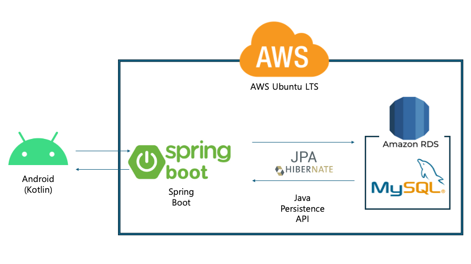

# receipt2recipe
## Functionality

영수증 스캔 한 번으로 레시피 추천

 

## Architecture

 

## Tech-Stack

| 분류      | 기술                                       |
| --------- | ------------------------------------------ |
| 서버 환경 | Amazon Ubuntu LTS                          |
| Database  | Amazon RDS, MySQL                          |
| Front-End | Android Native(Kotlin)                     |
| Back-End  | Spring Boot, JPA                           |
| API       | Google Cloud OCR (Google Cloud Vision API) |
| UI        | Figma                                      |

 

## Members

| 이름   | 학과         | 역할             |
| ------ | ------------ | ---------------- |
| 이승욱 | AI소프트웨어 | Back-End, DevOps |
| 채정민 | AI소프트웨어 | DB               |
| 송기남 | AI소프트웨어 | UI               |
| 이창엽 | AI소프트웨어 | Front-End        |

 

## Database Modeling
