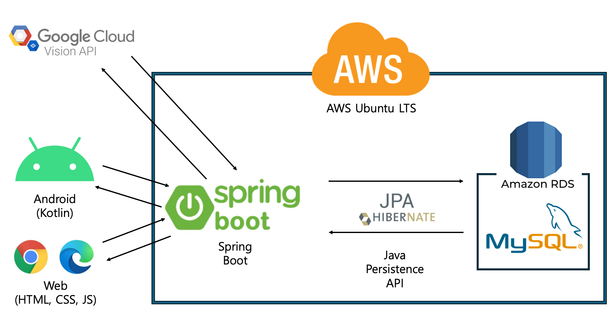

# 강원대학교 캡스톤디자인 - Recepit2Recipe

---

## Product

**영수증 인식 또는 사용자가 추가한 식재료를 바탕으로 레시피 추천 플랫폼**

---

## Members & Role

### Members

| 이름   | 학과         | 역할                    |
| ------ | ------------ | ----------------------- |
| 이승욱 | AI소프트웨어 | Back-End, Web Front-End |
| 채정민 | AI소프트웨어 | DB                      |
| 송기남 | AI소프트웨어 | UI                      |
| 이창엽 | AI소프트웨어 | Mobile Front-End        |

### Role

| 역할      | 설명                                                         |
| --------- | ------------------------------------------------------------ |
| Back-End  | -애플리케이션의 핵심 기능과 비즈니스 로직을 구현하는 역할 -데이터베이스와 클라이언트(프론트엔드) 간의 통신을 관리하고, 사용자 요청을 처리하여 적절한 응답을 제공 -RESTful API를 설계하고 개발하여 클라이언트가 서버와 상호작용할 수 있도록 함 |
| DB        | -데이터베이스 모델링을 통하여 데이터 구조를 명확히 정의하여 데이터 일관성을 유지하고 무결성을 보장 -이를 통해 데이터 중복을 줄이고 데이터의 정확성과 신뢰성을 확보 |
| UI        | -사용자에게 직관적이고 아름다운 인터페이스를 제공하여 사용 편의성 높이고, 좋은 경험을 할 수 있게 함 |
| Front-End | -사용자와 직접 상호작용하는 웹과 모바일 애플리케이션의 UI와 UX를 구현하여 사용자 경험을 향상시킴 -이를 통해 직관적이고 반응성 높은 인터페이스를 제공하여 사용자 만족도와 접근성을 높임 |

---

## Architecture

---

## Database Modelling

- `Member`와 `Fridge`: 1대1(One-to-One) 관계로, 한 회원은 하나의 냉장고만 가질 수 있다.
- `Fridge`와 `Ref_and_Igdt`: 1대다(One-to-Many) 관계로, 한 냉장고는 여러 재료를 가질 수 있다.
- `Ingredients`와 Ref_and_Igdt: 1대다(One-to-Many) 관계로, 한 재료는 여러 냉장고 재료에 포함될 수 있다.
- `Recipes`와 `Rcp_and_Seq`: 1대다(One-to-Many) 관계로, 한 레시피는 여러 조리 단계를 가질 수 있다. 
  ->`Rcp_and_Seq` 테이블의 `rcp_id` 필드는 `Recipes` 테이블의 `rcp_id`를 참조하여 각 조리 단계가 어떤 레시피에 속하는지를 정의.
- `Recipes`와 `Recipe_Igdt`: 1대다(One-to-Many) 관계로, 한 레시피는 여러 재료를 가질 수 있다.
- `Ingredients`와 `Recipe_Igdt`: 1대다(One-to-Many) 관계로, 한 재료는 여러 레시피 재료에 포함될 수 있다.
- `Member`와 `Heart`: 1대다(One-to-Many) 관계로, 한 회원은 각 레시피에 대해 하나의 찜만 할 수 있다 (UNIQUE 제약 조건).
- `Recipes`와 `Heart`: 1대다(One-to-Many) 관계로, 한 레시피는 여러 회원에게 찜받을 수 있다.
- `Member`와 `Reviews`: 1대다(One-to-Many) 관계로, 한 회원은 각 레시피에 대해 하나의 리뷰만 남길 수 있다 (UNIQUE 제약 조건).
- `Recipes`와 `Reviews`: 1대다(One-to-Many) 관계로, 한 레시피는 여러 리뷰를 받을 수 있다.

- **다대다 관계는 `Recipe_Igdt`와 `Ref_and_Igdt` 테이블을 통해 구현됨.**

> [!TIP]
>
> <u>**다대다(Many-to-Many) 관계는 두 테이블 간의 다수의 레코드가 서로 다수의 레코드와 관련될 수 있는 관계를 말한다.**</u> 
>
> 예를 들어, 하나의 레시피는 여러 재료를 필요로 하고, 하나의 재료는 여러 레시피에 포함될 수 있다. 이런 관계를 직접 테이블 간에 구현하면 복잡하고, 데이터의 일관성을 유지하기 어렵다. 
>
> 그래서 다대다 관계를 구현하기 위해 중간 테이블을 사용한다. 
>
> 중간 테이블은 두 테이블 간의 관계를 관리한다.

---

## Tech-Stack

| 분류              | 기술                        |
| ----------------- | --------------------------- |
| 서버 환경         | AWS Ubuntu LTS, Amazon RDS  |
| DB                | MySQL                       |
| Back-End          | Spring Boot, JPA(Hibernate) |
| Front-End(Web)    | HTML, CSS, JavaScript       |
| Front-End(Mobile) | Android Native(Kotlin)      |
| API               | Google Cloud Vision API     |
| UI                | Figma                       |

---

## Design

### Web

### Mobile

---

